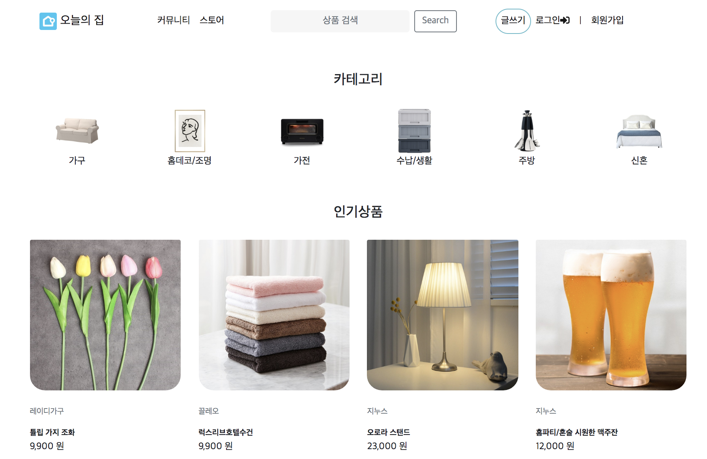
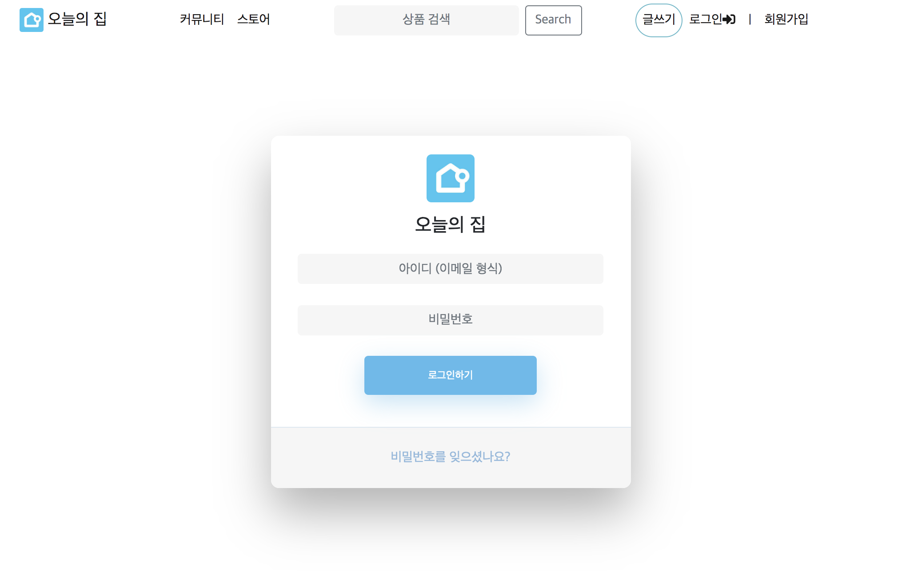
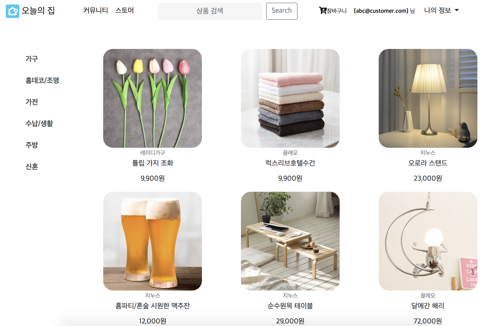
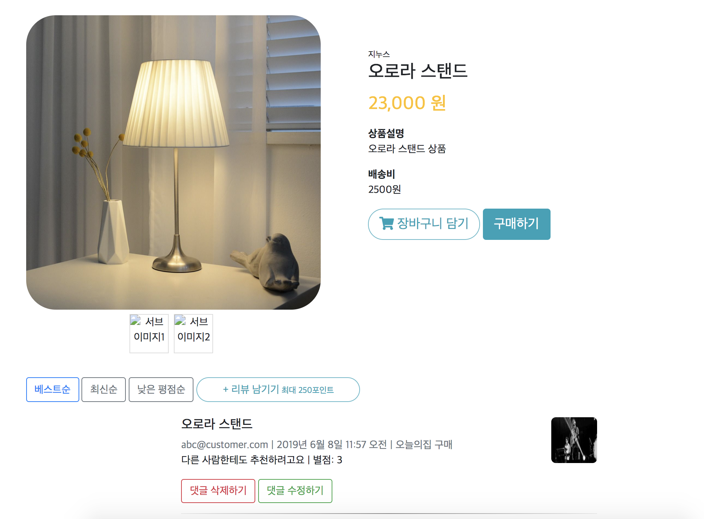
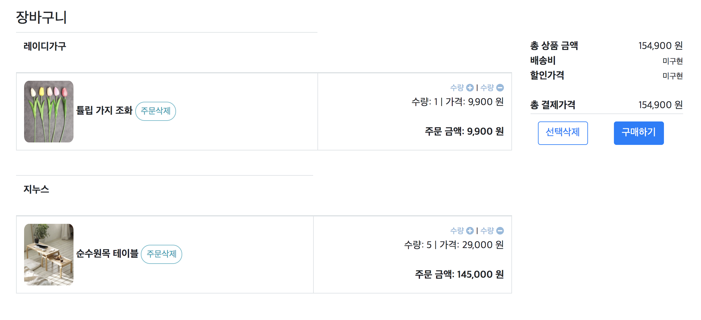
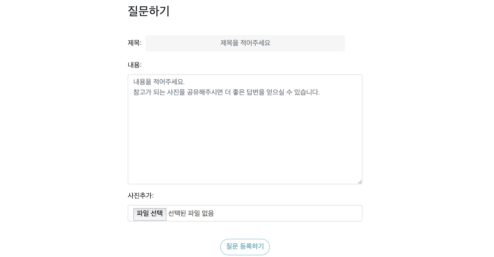
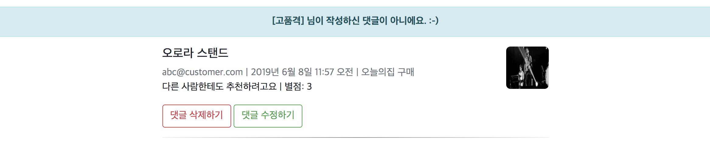

# 카피 사이트 프로젝트


## 오늘의 집

프로젝트 사이트\: `https://www.mht.kr`

개인 블로그 주소\: [프로젝트를 선정 이유와 느낀 점](https://dev-mht.tistory.com/146?category=851117)


### 프로젝트 개요

오늘의 집 사이트를 바탕으로 MTV 패턴에 대한 이해와 CRUD 를 구현

`member`

- 회원가입 기능
	- 유저 모델을 상속받아 USERNAME 필드를 Email 필드로 변경

- 로그인과 로그아웃 기능

`product`

### 커뮤니티 페이지
- 게시판에서 게시글의 CRUD 구현
- pagination 기능 구현


### 스토어 페이지
- 상품 리스트, 상품 디테일 페이지
- 장바구니 기능(상품을 담고 장바구니 페이지에서 상품의 수량 증감 기능)
- Django messages 를 활용하여 해당 유저가 아닐 경우 메시지로 안내


### requirements

- python 3.6
- pipenv
- Django 2.x


### Skills

- python 3.x
- Django
- Bootstrap 4
- AWS ElasticBeanstalk
- AWS RDS\(PostgresQL\)
- AWS S3
- Docker
- fontawsome
- crispy\-forms

### Secrets

`.secrets/base.json & production.json`

```
{
  "SECRET_KEY": "<Django secret key>"
}

```

### Running

```
# 패키지 설치
pipenv install

# 가상환경 접속
pipenv shell

# local 환경으로 설정
export DJANGO_SETTINGS_MODULE=config.settings.local

# production 환경으로 설정
export DJANGO_SETTINGS_MODULE=config.settings.production

# local 환경에서 접속
#	localhost:8000
python manage.py runserver
```

### ScreenShot

**\[메인 페이지\]**



***

**\[로그인 페이지\]**



***

**\[상품 메인 페이지\]**


***

**\[상품 디테일 페이지\]**


***

**\[장바구니\]**


***

**\[질문하기\]**


***

**\[글을 작성한 유저가 아닐 경우 message 처리\]**


